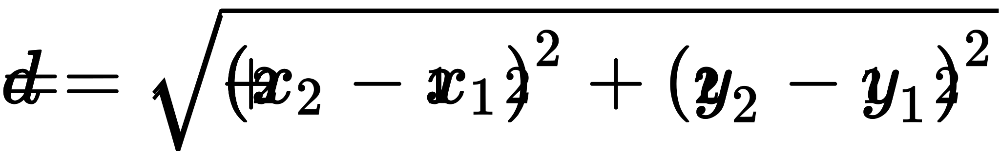

## CS-UY 1114 — Lab 10
# Number Systems, `chr` and `ord`, and a Soft Introduction to Object-Oriented Programming
#### Friday, April 23rd, 2021


**All lab work must be submitted within 24 hours of the start of your lab period on Gradescope** (we will be checking
this using the timestamps of your last submission on GradeScope). This, of course, also means that if you submit a
solution before your allotted lab time, you will get no credit. You must try each problem at least once (that is,
submitting at least one attempt to GradeScope, whether it is correct or not). You are welcome to continue to work on the
problems and continue submitting to Gradescope until you are satisfied with your results. It is your responsibility to
remember to submit your work.


Please note that your overall point value is awarded by the teaching assistants verifying that you attempted and
submitted each problem at least once! For every hour that your work is late on GradeScope, we will deduct 0.5 points
from the total 10-point value of the lab. **The points awarded by the auto-grader on GradeScope will not be counted
towards your lab's grade, so don't worry if you don't pass every or any of its tests!**


Please do not hesitate to check with your TAs if you are ever confused as to how to proceed!


---

### Important Note on Lab Collaboration

While discussion of the lab problems is allowed amongst students in the course, when it is time to implement your
solution, the code must be **entirely** your own work. Submitting code that has been written by someone other than
yourself will, at a minimum, result in receiving a 0 on the lab assignment. Other possible penalties include having
the incident reported to the Office of Student Affairs to be added to your official academic record and/or failing the
course.

---

### Congratulations on getting through midterm 2!

No simple feat, I'm telling you. The material included in midterm 2 was tough, so I commend everyone for soldiering 
through it. If you can believe it, it only gets better from here. Or, if you don't like the sound of "better", then I'll
at least say that we are getting to the most interesting parts of the course soon. I'll do my best to reflect my 
enthusiasm by giving you fun lab problems.

As usual, we're here to answer any questions you may have.

— _Sebastián_.

_P.S.: We've been seeing a good amount of students relying on `break` to stop `while` loops. This is **very** bad 
practice and is a habit you'd do best to get out of. If you find yourself using a `while` in this lab, do **not** use 
`break`. You almost never need to use `break` and we certainly never write problems that require it._

---

### Problem 1.1: _Computers Dream In Binary_

We'll start off in the file [**binary_to_decimal.py**](binary_to_decimal.py).

Write a function called **`binary_to_decimal()`**, that accepts `binary_list` as a parameter, a list representing a 
binary number.

Your job is to simply convert the binary number represented by `binary_list` to its corresponding decimal value. Check 
out the sample behavior below:

```python
def main():
    binary = [1, 0, 0, 1, 1, 1]
    print(binary_to_decimal(binary))

main()
```
Output:
```text
39
```

You may assume all binary values will not be negative. Believe me, you don't want to deal with that mess.

### Problem 1.2: _Hex Maniac_

In the file [**binary_to_decimal.py**](binary_to_decimal.py), write a function called **`binary_to_hex()`** that 
accepts `binary_list` as a parameter, a list representing a binary number.

Your job, much like in problem 1.1 is to convert the binary number represented by `binary_list` to its 
corresponding hexadecimal decimal value ***as a string***:

```python
def main():
    binary = [1, 0, 0, 1, 1, 1, 0, 1]
    print(binary_to_hex(binary))

main()
```
Output:
```text
9d
```

For this problem, you may assume that all binary lists will be of a length that is divisible by 4. The following table
may be useful:

| **Decimal** | **Binary** | **Hexadecimal** |
|-------------|------------|-----------------|
|           1 | 1          | 1               |
|           2 | 10         | 2               |
| 3           | 11         | 3               |
| 4           | 100        | 4               |
| 5           | 101        | 5               |
| 6           | 110        | 6               |
| 7           | 111        | 7               |
| 8           | 1000       | 8               |
| 9           | 1001       | 9               |
| 10          | 1010       | a               |
| 11          | 1011       | b               |
| 12          | 1100       | c               |
| 13          | 1101       | d               |
| 14          | 1110       | e               |
| 15          | 1111       | f               |
| 16          | 10000      | 10              |
| 17          | 10001      | 11              |

<sub>_**Table 1**: Decimal, binary, and hexadecimal equivalents of 1-16._</sub>

_**Hint**: There are multiple ways to approach this problem, but the way I would think about is is the following:_

_Try thinking of binary numbers as if they were grouped by 4 digits._

_That is, instead of writing `5` as `101`, it would instead be `0101`. Similarly, `17` would be `0001 0001` instead of 
`10001`. All I'm doing is adding zeroes to the front of the number to make its length a multiple of 4. Every group of 
four digits in binary correspond to a hexadecimal value (e.g. `1101` corresponds to `d`, `0010` to `2`, etc.) So, 17 
would be `10001` —> `00010001` —> `0001 0001` —> `1 1` —> `11` since binary `0001` maps to hexadecimal `1`._

_Which data type have we been using in class that collects pairs of values that correspond to each other?_

### Problem 2: _You Are The Impostor_

In the file [**among_us.py**](among_us.py), write a function, **`is_impostor()`**, that will accept two parameters. The
first, `information`, will be a dictionary of the following format:

```python
dictionary_example = {
    "Band Name": "Example Band Name",
    "Members": {
        "Guitarist": "Example Name",
        "Bass Player": "Example Name",
        "Drummer": "Example Name",
        "Singer": "Example Name"
    }, 
    "Albums": ["Album Number 1", "Album Number 2"]
}
```

In other words, a dictionary including the information of a music band. You may assume every band has the same number
and type of members.

The second parameter, `corrupter_function`, will be a function. Yes, you read that right. In Python, it is entirely 
possible to pass functions as parameters. You don't need to worry about how this works, or about what kind of 
function `corrupter_function` will be.

The actual corrupter function (let's call it `corrupter()`) itself accepts one dictionary object and returns ***either 
a shallow or a deep copy of the original dictionary***. Since you don't have access to the contents of `corrupter()`, 
you won't know if a deep or a shallow copy has been returned. That's where you come in. You will have to find a way to 
determine whether the dictionary returned by `corrupter()` is a deep or a shallow copy.

If you determine that `corrupter()` has produced a deep copy, return `True`. Otherwise, return `False`.

These are all the hints you are getting, and while it may sound like 
a bit of an abstract problem, think of what it means to be a **deep** copy of of an object, and what it means to be a 
**shallow** copy of an object. The program should actually be very short and simple.

Here's a possible implementation of your `main()` function:

```python
from super_secret_module import corrupter

def main():
    sample_band = {
        "Band Name": "Silk Sonic",
        "Members": {
            "Guitarist": "D'Mile",
            "Bass Player": "Christopher Brody Brown",
            "Drummer": "Andreson .Paak",
            "Singer": "Bruno Marks"
        },
        "Albums": ["Leave the Door Open - Single", "An Evening with Silk Sonic"]
    }

    if is_impostor(sample_band, corrupter):
        print("is_impostor returned a deep copy!")
    else:
        print("is_impostor returned a shallow copy!")
```

Of course, the output will vary depending on whether `corrupter()` returned a deep or shallow copy. If you would like 
to create a sample corrupter function for testing purposes, you can always write a function that returns either a deep 
or shallow copy of an object at random.

By the way, if you're wondering how to use functions passed into other functions, here's a quick example:

```python
# Some mathematical operations
def add(a, b):
    return a + b

def subtract(a, b):
    return a - b

def multiply(a, b):
    return a * b

def divide(a, b):
    return a / b

# Our calculator function doesn't care what function "operation" is. It just passes "a" and "b" into the function assigned to the `operation` parameter.
def calculator(a, b, operation):
    return operation(a, b)

def main():
    product = calculator(4, 5, multiply)  # Notice that I didn't include () after multiply -- just the name of the function is used in the function call.
    print(product)

main()
```
Output:
```text
20
```

### Problem 3: _Et tu, programmator?_

In the file [**caesar_cipher.py**](caesar_cipher.py), write a function called **`decode_caesar()`** that will 
accept `encoded_message`, a string containing a message encoded using a 
[**Caesar cipher**](https://en.wikipedia.org/wiki/Caesar_cipher), and `key`, which is the shift that will be used to 
decode the message.

The Caesar cipher isn't exactly intuitive, so let's talk about how it works. Let's say we have the following snippet of 
the lyrics to Electric Light Orchestra's 1985 hit, 
[**"_Calling America_"**](https://www.youtube.com/watch?v=xNUbBpZ9Ac0):
```text
Talk is cheap on satellite
But all I get is static information
I'm still here
Re-dial on automatic
```
If we wanted to encode this using the Caeser cipher, with a key of (for example) 3. We would shift each letter's 
alphabetical index by 3 steps (i.e. `"a"` has an alphabetical index of 1, so if we shift it by 3, we'd get 4, or `"d"`;
"b" has an alphabetical index of 2, etc.). These are the lyrics encoded:

```text
Wdon lv fkhds rq vdwhoolwh
Exw doo L jhw lv vwdwlf lqirupdwlrq
L'p vwloo khuh 
uh-gldo rq dxwrpdwlf
```

Your job is to **decode** encrypted messages like this, and return the decoded, original message.

Here's some sample behavior I've included using a [**file**](calling_america_lyrics.txt) containing the full set of 
lyrics of Calling America, encrypted with a key of 3:

```python
def main():
    decryption_key = 3

    try:
        file = open("calling_america_lyrics.txt", 'r')
    except FileNotFoundError:
        print("ERROR: File not found!")
    else:
        for line in file:
            line = line.strip()
            decrypted_line = decode_caesar(line, decryption_key)
            print(decrypted_line)

        file.close()

main()
```
Output:
```text
Somebody told her that there was a place like heaven
Across the water on a seven-forty-seven
Yeah, we're living in
In a modern world
And pretty soon she's really got the notion
Of flying out across the big blue ocean
Yeah, we're living in
In a modern world
Talk is cheap on satellite
But all I get is static information
I'm still here re-dial on automatic
Calling America (can't get a message through)
Calling America (that's what she said to do)
Calling America (that's where she has to be)
Calling America (she left a number for me)
Calling America
But I'm just talking to a satellite
Twenty thousand miles up in the sky each night
Yeah, we're living in
In a modern world
All I had to do was pick up the phone
I'm out in space, trying to talk to someone
Yeah, we're living in
In a modern world (in a modern world)
She left a number I could call
But no one's there, no one at all
There must be something going wrong
That number just rings on and on
Calling America (can't get a message through)
Calling America (that's what she said to do)
Calling America (that's where she has to be)
Calling America (she left a number for me)
Calling America
Said she'd call when she'd been gone a while
Guess she's missing me across the miles
Yeah, we're living in
In a modern world
Calling America (can't get a message through)
Calling America (that's what she said to do)
Calling America (that's where she has to be)
Calling America (she left a number for me)
```

My recommendation is to define a separate function that decrypts a single letter. Then, you can create a new, decoded
string letter by letter.

Note the following:

- Your program should be case-sensitive. That is, if our decoding key is 3, `"A"` shifts to `"D"` and `"a"` shifts to
`"d"`.
- You may assume that you will always know the value of the decryption key.
- Your program should only shift characters that belong to the English dictionary. As such, you may assume the encoded
message will be in English. (Caesar would have likely disapproved of this)
- Naturally, any modules that decode the Caesar cipher (of which I am sure there is at least one), are forbidden in this
problem. Everything must be done manually, letter by letter, by you.

**HINT**: The usefulness of `ord` and `chr` is likely obvious, but `%` (the modulus operator) will also come in very 
handy. To understand why, consider the instance of shifting `"x"`, `"y"`, or `"z"` when the decryption key is 3. As 
there is no letter after `"z"`, we must "rotate" back to `"a"`. A look at the Caeser cipher's wiki page (linked above) 
might help make this clear as well.

### Problem 4 (Optional, but highly recommended): _Floating Points_

Ah yes, object-oriented programming.

You'll have a lab entirely dedicated to this amazing topic next week where I'll gush more about it, but here's a simple
program to get you used to thinking in terms of classes and objects.

In the file [**coordinates.py**](coordinates.py), define a **class** called **`Point`** that will be initialized with 
the following parameters:

| **Parameter** | **Type**         | **Notes**                                                               |
|---------------|------------------|-------------------------------------------------------------------------|
|   _`x_coord`_ | `int` or `float` | Represents the value of the x-coordinate of a point in Cartesian space. |
|   _`y_coord`_ | `int` or `float` | Represents the value of the y-coordinate of a point in Cartesian space. |

<sub>_**Table 2**: Parameters used to initialize a **`Point`** object. It's very important that you follow the names of 
these variables._</sub>

Your program should thus exhibit the following behavior:

```python
some_point = Point(4, 5.6)

print(some_point.x_coord)
print(some_point.y_coord)
```
Output:
```text
4
5.6
```

Make sure that you get this exact behavior working before moving on!

Next, inside your **`Point`** class definition, define a method called `get_distance()` that will accept one parameter:
another **`Point`** object. `get_distance()` will then calculate the distance between these two points based on their
x- and y-coordinates. Recall the distance formula:



<sub>_**Figure 1**: Formula to calculate the distance, `d`, between two points in a Cartesian coordinate system._ [**Source**](https://g.co/kgs/Z981Jn) </sub>

If implemented correctly, your program should behave as follows:

```python
some_point = Point(4, 5.6)
other_point = Point(10, 29.3)

distance = some_point.get_distance(other_point)
print(distance)
```
Output
```text
24.447699278255207
```


You can assume that the user will always pass a **`Point`** object into `get_distance()`.

